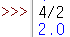

# 1) 연산자

- 수식(expression): 피연산자들과 연산자의 조합
    - 연산자(operator): 연산을 나타내는 기호
    - 피연산자(operand): 연산의 대상이 되는 값
- ** 연산자: 제곱
ex) `x**2 = x*x = x^2`
- // 연산자: 소수점 이하 삭제 (= 몫)
- % 연산자: 나눈 나머지 (modulus 연산 = 나머지)
    
    `9//2`     #결과: 4
    `25%3`     #결과: 1
    
- 이때 / 연산자(단순 나눗셈) 은 최소 소수점 한자리까지 결과가 나옴(딱 떨어져도)
    
    
    
- 대입연산자
    - /= 연산자: 나눈값을 대입 (마찬가지로 최소 소수점 한자리)
    - %= 연산자: 나눈 나머지의 값을 대입
- 비교연산자
    - 결과값은 boolean
- 논리연산자
    - and
    - or
    - not
- 연산자 우선순위
    - 괄호 > 지수승 > 곱셈 = 나눗셈 > 덧셈 = 뺄셈
    - 같은 우선순위를 갖는 연산자는 왼쪽에서 오른쪽으로 진행
    - 문자열의 경우 순서가 빠를수록 작다고 본다.
        
        ex) `False < True`
        
- abs(): 절대값 함수
